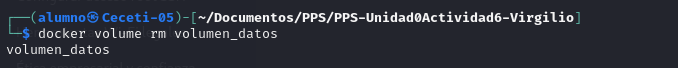
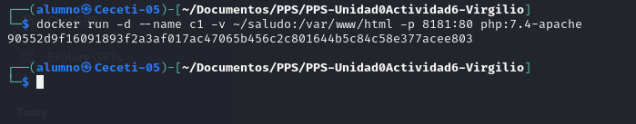

# Almacenamiento

## Entrega uno de estos dos ejercicios (si estás muy aburrido puedes entregar los dos):

### Creación y uso de volúmenes

Crear los siguientes volúmenes con la orden docker volume: volumen_datos y volumen_web.

Una vez creados estos contenedores:
    
Arrancar un contenedor llamado c1 sobre la imagen php:7.4-apache que monte el volumen_web en la ruta /var/www/html y
que sea accesible en el puerto 8080.

Arrancar un contenedor llamado c2 sobre la imagen mariadb que monte el volumen_datos en la ruta /var/lib/mysql y 
cuya contraseña de root sea admin.

Intenta borrar el volumen volumen_datos, para ello tendrás que parar y borrar el contenedor c2 y tras ello borrar el 
volumen.

Copia o crea un fichero index.html al contenedor c1, accede al contenedor y comprueba que se está visualizando.

Borra el contenedor c1 y crea un contenedor c3 con las mismas características que c1 pero sirviendo en el puerto 8081.

Deberás entregar los siguientes pantallazos comprimidos en un zip o en un documento pdf:

Pantallazo donde se puedan ver los dos volúmenes creados.

Pantallazo con la orden correspondiente para arrancar el contenedor c1 usando el volumen_web.

 

### Bind mount para compartir datos

Crea una carpeta llamada saludo y dentro de ella crea un fichero llamado index.html con el siguiente contenido (Deberás 
sustituir ese XXXXXx por tu nombre.):

 

<h1>HOLA SOY XXXXXX</h1>

Una vez hecho esto arrancar dos contenedores basados en la imagen php:7.4-apache que hagan un bind mount de la carpeta 
saludo en la carpeta /var/www/html del contenedor. Uno de ellos vamos a acceder con el puerto 8181 y el otro con el 
8282. Y su nombres serán c1 y c2.

 

Modifica el contenido del fichero ~/saludo/index.html.

 

Comprueba que puedes seguir accediendo a los contenedores, sin necesidad de reiniciarlos.

 

Deberás entregar los siguientes pantallazos comprimidos en un zip o en un documento pdf:

 

 
 

