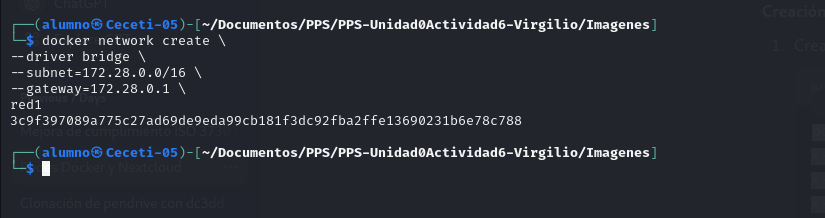
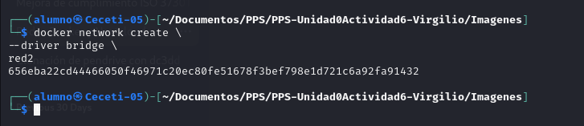
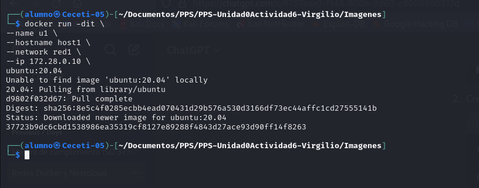
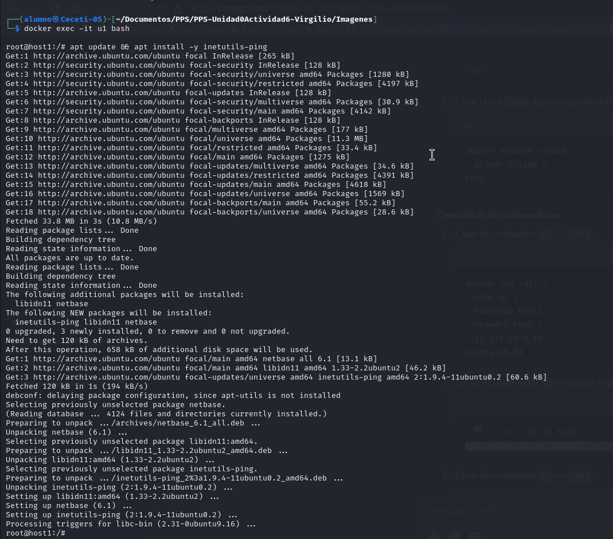

# Redes

## Entrega uno de estos dos ejercicios (si estás muy aburrido puedes entregar los dos):

Trabajar con redes docker
### Vamos a crear dos redes de ese tipo (BRIDGE) con los siguientes datos:

Red1

Nombre: red1
Dirección de red: 172.28.0.0
Máscara de red: 255.255.0.0
Gateway: 172.28.0.1
Red2

Nombre: red2
Es resto de los datos será proporcionados automáticamente por Docker.

Poner en ejecución un contenedor de la imagen ubuntu:20.04 que tenga como hostname host1, como IP 172.28.0.10 y que esté conectado a la red1.

Lo llamaremos u1.
Entrar en ese contenedor e instalar la aplicación ping (apt update && apt install inetutils-ping).

Poner en ejecución un contenedor de la imagen ubuntu:20.04 que tenga como hostname host2 y que esté conectado a la red2. 

En este caso será docker el que le de una IP correspondiente a esa red. Lo llamaremos u2.

Entrar en ese contenedor e instalar la aplicación ping (apt update && apt install inetutils-ping).

Pantallazo donde se vea la configuración de red del contenedor u1.

Pantallazo donde se vea la configuración de red del contenedor u2.

Pantallazo donde desde cualquiera de los dos contenedores se pueda ver que no podemos hacer ping al otro ni por ip ni por nombre.

Pantallazo donde se pueda comprobar que si conectamos el contenedor u1 a la red2 (con docker network connect), desde el contenedor u1, tenemos acceso al contenedor u2 mediante ping, 
tanto por nombre como por ip.

### Crea una red de tipo bridge.

Crea el contenedor de la base de datos conectado a la red que has creado. La base de datos se debe configurar para crear una base de dato y un usuario. Además el contenedor debe utilizar almacenamiento (volúmenes o bind mount) para guardar la información. Puedes seguir la documentación de mariadb o la de PostgreSQL.

A continuación, siguiendo la documentación de la imagen nextcloud, crea un contenedor conectado a la misma red, e indica las variables adecuadas para que se configure de forma adecuada y realice la conexión a la base de datos. El contenedor también debe ser persistente usando almacenamiento.

Accede a la aplicación usando un navegador web.

Pantallazo donde se ve el acceso a la aplicación desde un navegador web.

